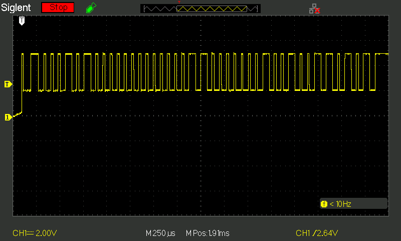

# DHT11 Driver for GD32VF103

Driver for the DHT11 temperature and humidity sensor for the GD32VF103 MCU.

## Features
- Reads temperature and humidity
- Blocking ~4ms implementation
- Simple polling-based timing using Timer6

## Dependencies
- General Purpose Timer6 (`TIMER6`)
- GPIO (input)
- Pull-up resistor on data line (typically 10kΩ)

## 📌 Pin Configuration

The user must provide the GPIO base and pin used for the data line when initializing the driver.

| Function   | Description                      | Configurable? | Example              |
|------------|----------------------------------|----------------|----------------------|
| `DATA`     | 1-wire data signal               | ✅ Yes         | `GPIOA`, `GPIO_PIN_1`|
| `VDD`      | Power supply                     | ❌ No          | 5V                   |
| `GND`      | Ground                           | ❌ No          | GND                  |

> 💡 **Note:** Use a pull-up resistor (≈10kΩ) between `VDD` and `DATA` pin.

## 🧠 How it works

The MCU communicates with the DHT11 sensor by following the strict timing protocol defined in the datasheet:

1. MCU pulls data pin **LOW for ≥18ms** (start signal)
2. MCU releases pin (set as input)
3. DHT11 responds with:
   - **80 µs LOW** + **80 µs HIGH** (response)
4. Then transmits **40 bits** of data (temp + humidity + checksum)

