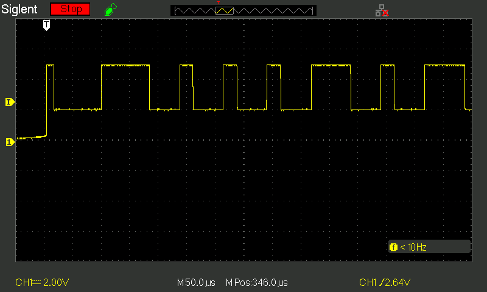

# DHT11 Driver for GD32VF103

This is a simple driver for the DHT11 temperature and humidity sensor,
written for the GD32VF103 MCU using the GD32VF103 standard peripheral library.

## Features
- Reads temperature and humidity
- Blocking (Timer based) implementation

## Dependencies
- GD32VF103 Standard Peripheral Library
- General Purpose Timer6 


## Note
This driver is specific to the GD32VF103 platform and uses functions like:
```c
gpio_input_bit_get(GPIOA, GPIO_PIN_1);
timer_enable(TIMER6);
```

## How it works
The MCU polls the DHT11 sensor module by following a strict pattern from the datasheet https://www.electrokit.com/upload/product/41015/41015728/DHT11.pdf 
By setting the data pin LOW and HIGH for a predetermined anount of time, the sensor module responds with 5 bytes of data, the last byte is a checksum, see pictures below



